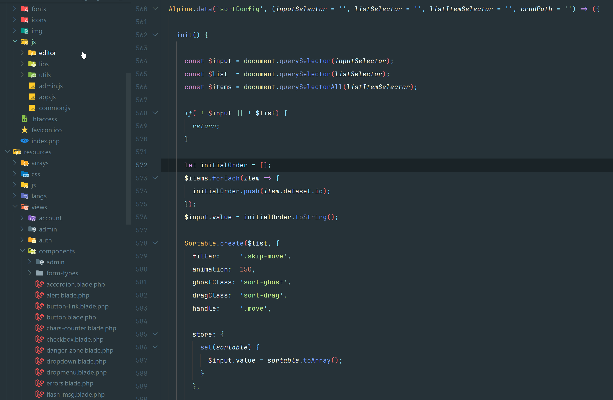
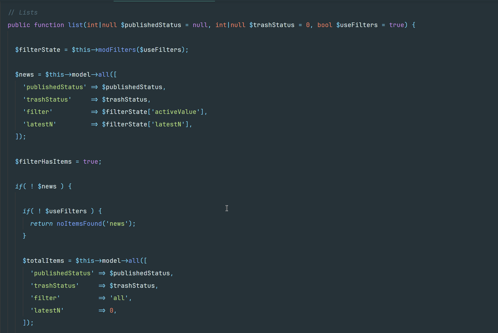
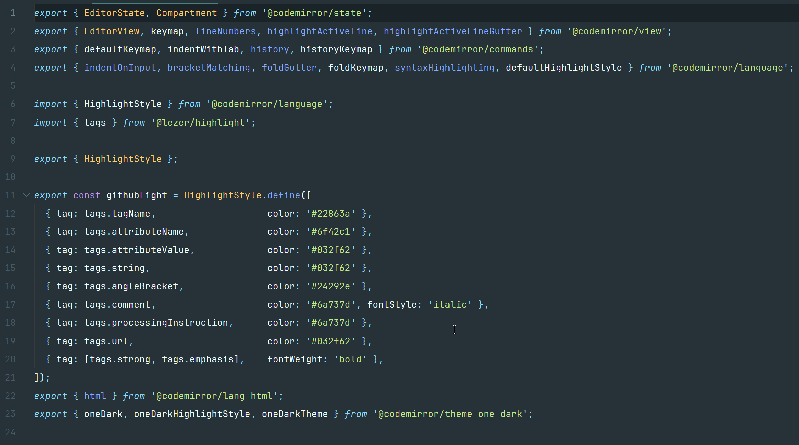
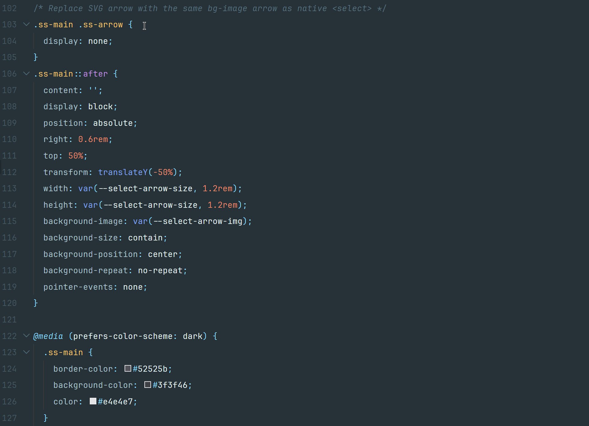
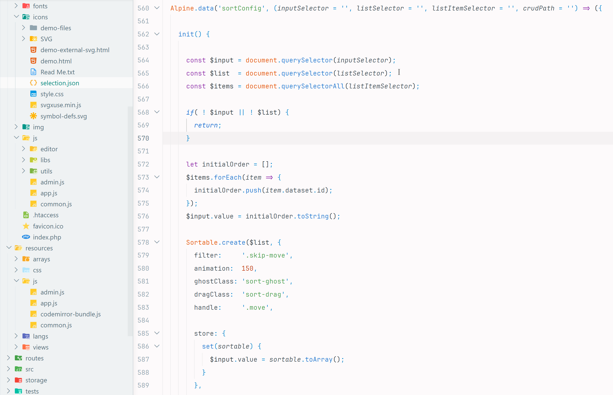
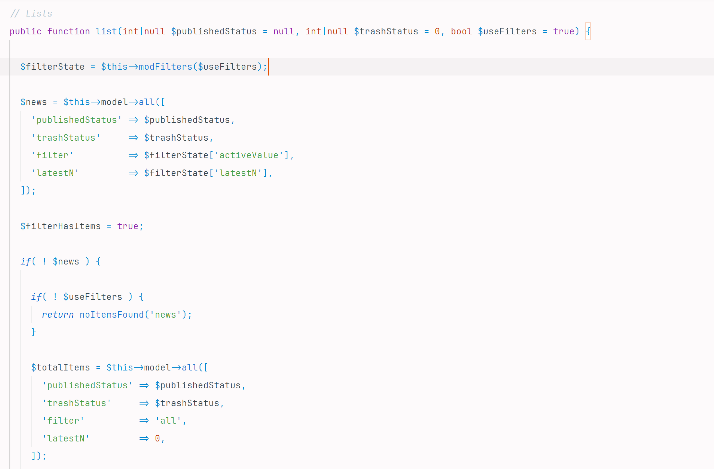
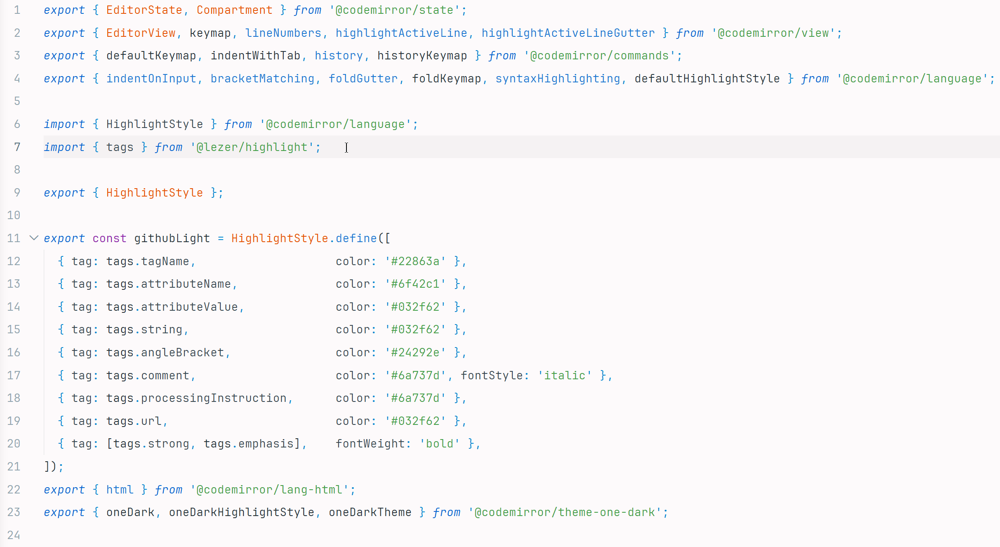
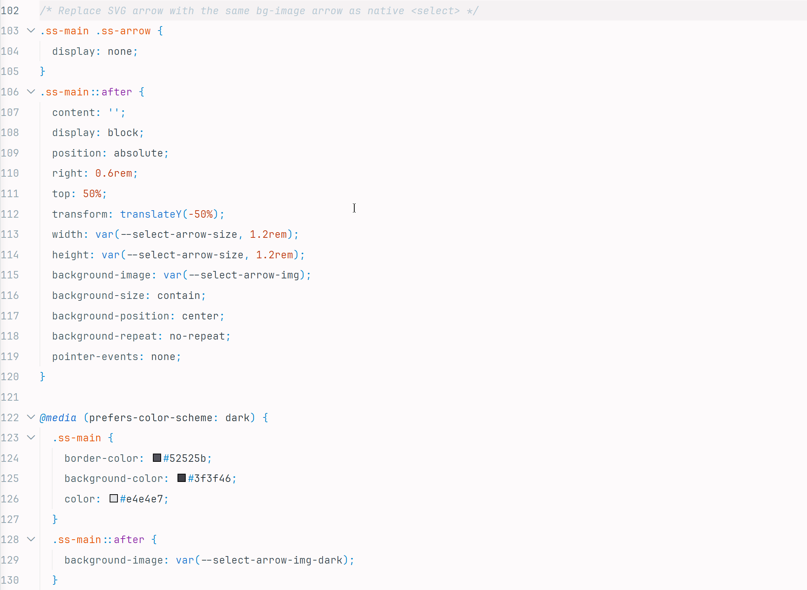

# Spectabile Material Theme

A spiritual successor to the popular **Material Theme** (**[Equinusocio.vsc-material-theme](https://marketplace.visualstudio.com/items?itemName=Equinusocio.vsc-material-theme)**, now deprecated) — rebuilt from scratch, no tracking, no bundled binaries. Available in **dark** and **light** variants, with semantic highlighting enabled and hand-tuned token colors for PHP, JavaScript, TypeScript, Python, and more.

---

## Screenshots

### Spectabile Material Dark






### Spectabile Material Light






---

## Recommended Fonts

The theme is designed and tested with **JetBrains Mono NF**. Font weight matters a lot with monospace themes:

| Theme variant | Recommended weight | Why |
|---|---|---|
| Spectabile Material Dark | **Extralight** | Fine strokes feel at home against a dark background — heavy weights can feel noisy |
| Spectabile Material Light | **Light** or **Regular** | Heavier strokes improve contrast and legibility on a light background |

**Tested and recommended fonts:**

| Font | Download |
|---|---|
| JetBrains Mono NF *(primary choice)* | [jetbrains.com/lp/mono](https://www.jetbrains.com/lp/mono/) |
| MesloLGS Nerd Font | [github.com/ryanoasis/nerd-fonts](https://github.com/ryanoasis/nerd-fonts/releases) |
| MesloLGS NF | [github.com/romkatv/powerlevel10k](https://github.com/romkatv/powerlevel10k/blob/master/font.md) |
| Fira Code | [github.com/tonsky/FiraCode](https://github.com/tonsky/FiraCode) |

## Recommended Icon Theme

[Material Icon Theme](https://marketplace.visualstudio.com/items?itemName=PKief.material-icon-theme) by Philipp Kief pairs perfectly with both variants.

---

## Color Palette

### Dark — Spectabile Material Dark

| Role | Color |
|---|---|
| Background | `#263238` |
| Foreground | `#EEFFFF` |
| Accent (teal) | `#80CBC4` |
| Strings | `#C3E88D` |
| Keywords / Punctuation | `#89DDFF` |
| Functions | `#82AAFF` |
| Types / Classes | `#FFCB6B` |
| Numbers | `#F78C6C` |
| Comments | `#546E7A` *(italic)* |

### Light — Spectabile Material Light

| Role | Color |
|---|---|
| Background | `#FDFAFB` |
| Foreground | `#263238` |
| Accent (teal) | `#00897B` |
| Strings | `#2E7D32` |
| Keywords / Punctuation | `#0288D1` |
| Functions | `#1565C0` |
| Types / Classes | `#E65100` |
| Numbers | `#BF360C` |
| Comments | `#90A4AE` *(italic)* |

---

## Language Support

JavaScript · TypeScript · PHP · Blade · CSS · HTML · JSON · YAML · Markdown · Python · C#

---

## Theme Overrides

VS Code lets you override any theme color or syntax rule without touching the theme file. Add these blocks to your `settings.json` (**File → Preferences → Settings → Open Settings JSON**).

### UI color overrides

```jsonc
"workbench.colorCustomizations": {
    "[Spectabile Material Dark]": {
        "tab.activeBorder": "#47847e",
        // "editorIndentGuide.background1": "#3a3a3a",
        // "editorIndentGuide.activeBackground1": "#4a4a4a",
        "foreground": "#cccccc",
        "descriptionForeground": "#cccccc"
    },
    "[Spectabile Material Light]": {
        // "tab.activeBorder": "#cccccc",
        // "editorIndentGuide.background1": "#eeeeee",
        // "editorIndentGuide.activeBackground1": "#ccc"
    }
},
```

→ Full list of UI color keys: [VS Code Theme Color Reference](https://code.visualstudio.com/api/references/theme-color)

### Syntax token overrides

```jsonc
"editor.tokenColorCustomizations": {
    "[Spectabile Material Dark]": {
        "textMateRules": [
            {
                "scope": "comment",
                "settings": {
                    "foreground": "#597480",
                    "fontStyle": "italic"
                }
            },
            {
                "scope": "keyword.other.phpdoc.php",
                "settings": {
                    "foreground": "#6c8692",
                    "fontStyle": "italic"
                }
            },
            {
                "scope": "meta.other.type.phpdoc.php keyword.other.type.php",
                "settings": {
                    "foreground": "#e8b94b",
                    "fontStyle": "italic"
                }
            }
        ]
    },
    "[Spectabile Material Light]": {
        "textMateRules": [
            {
                "scope": "comment",
                "settings": {
                    "foreground": "#b5c8d3",
                    "fontStyle": "italic"
                }
            },
            {
                "scope": "comment punctuation.definition.comment, string.quoted.docstring",
                "settings": {
                    "foreground": "#b5c8d3",
                    "fontStyle": "italic"
                }
            }
        ]
    }
},
```

### How to find scope names

The hardest part of writing overrides is knowing the exact scope name for the token you want to target. Two ways to find them:

1. **Token Inspector** — open the Command Palette (`Ctrl+Shift+P`) and run **Developer: Inspect Editor Tokens and Scopes**. Click on any token in your editor. The panel shows its TextMate scope stack and semantic token type — copy either directly into your override.

2. **Reference docs:**
   - UI color keys → [VS Code Theme Color Reference](https://code.visualstudio.com/api/references/theme-color)
   - Customizing syntax colors → [VS Code: Customizing a Color Theme](https://code.visualstudio.com/docs/getstarted/themes#_customizing-a-color-theme)
   - TextMate scope naming conventions → [TextMate Language Grammars](https://macromates.com/manual/en/language_grammars)

---

## Installation

Search for **Spectabile Material Theme** in the VS Code Marketplace, or install manually via **Extensions → Install from VSIX…**.

After installing, select a variant via **Preferences → Color Theme**:
- **Spectabile Material Dark**
- **Spectabile Material Light**

---

## License

MIT
